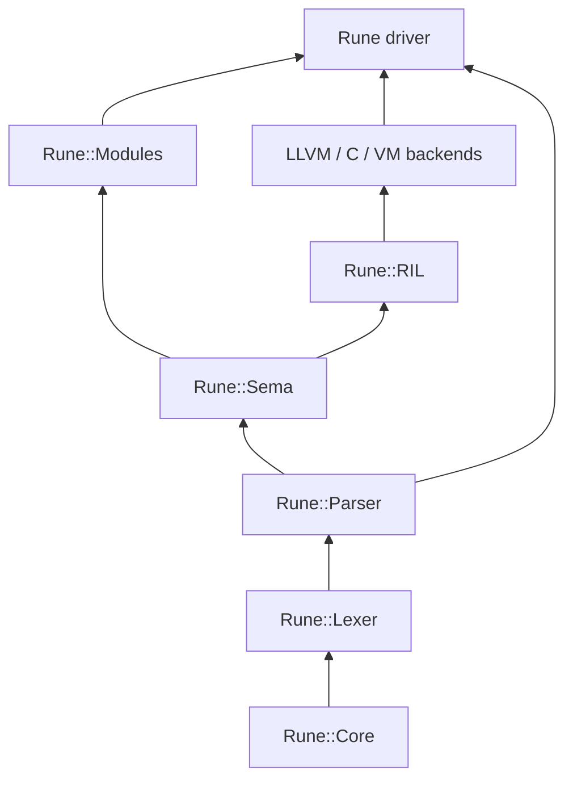
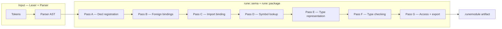

# Developer introduction — code organization

This document orients contributors to the Rune **compiler libraries** under `Code/Rune/`. It explains how the major layers fit together and how semantic analysis is split into passes.

For language syntax and user-facing tooling, see [Users/INTRODUCTION.md](../Users/INTRODUCTION.md) and [Users/COMMAND_LINE.md](../Users/COMMAND_LINE.md).

## Getting the binary

After configuring and building with CMake:

```bash
cmake --preset ninja-debug
cmake --build --preset ninja-debug
```

Typical debug binary paths are:

```text
Binaries/Windows/Debug/Rune/rune.exe
Binaries/Darwin/Debug/Rune/rune
Binaries/Linux/Debug/Rune/rune
```

Prebuilt Standard, Rune, and LibC modules are emitted alongside it in `Binaries/.../Rune/modules/`.

## Repository layout

```text
Code/
├── Rune/                 Compiler libraries and the `rune` driver
│   ├── Core/             Shared infrastructure
│   ├── Lexer/            Tokenization
│   ├── Parser/           Syntax analysis → AST
│   ├── Sema/             Semantic analysis
│   ├── RIL/              Canonical lowered intermediate representation
│   ├── Modules/          Manifests + `.runemodule` I/O and import binding
│   ├── LLVM/             LLVM backend
│   ├── C/                C backend
│   ├── VM/               RIL-based VM artifact, backend, and interpreter
│   ├── Rune/             CLI driver
│   ├── LSP/              Language server
│   └── ConstEvaluator/   Compile-time evaluation
├── Modules/              Rune **source** for stdlib modules
├── Runtime/              C++ runtime used by the interpreter and transpiler
├── Tests/                Catch2 tests
└── Tools/                Generators and build helpers
```

Each library is a static CMake target (`Rune::Core`, `Rune::Lexer`, …) declared in its `CMakeLists.txt`. Public headers live under `Code/Rune/<Lib>/Rune/<Lib>/`.

### Dependency direction

Compiler front-end dependencies flow **one way** — lower layers never include higher ones:



`rune::manifest` / `rune::package` sits on top of Sema because module **building** runs the semantic pipeline and then writes `.runemodule` artifacts. The driver (`Code/Rune/Rune/`) links everything needed for `rune build`, `rune dev parse`, and related commands.

### Source modules vs compiler modules

Do not confuse:

| Path | What it is |
|---|---|
| `Code/Modules/Rune/*.rune` | Standard library **source** compiled into `Rune.runemodule` |
| `Code/Rune/Sema/` | Compiler **semantic analysis** library |
| `Code/Rune/Modules/` | Compiler support for **manifests** and **package** files |

---

## Rune::Core

**Role:** Language-agnostic utilities shared across the toolchain.

Core owns types, diagnostics, binary I/O, platform detection, identifier storage, source locations, and the unified **FFI** layer (under `Rune/Core/FFI/`). Nothing in Core knows about Rune syntax, tokens, or declarations.

| Area | Key types / files |
|---|---|
| Containers & strings | `Array`, `String`, `StringView`, `HashMap`, `Optional`, `Result`, … (`Rune/Core/*.hpp`) |
| Diagnostics | `DiagnosticEngine`, `SourceLocation`, `SourceContext` |
| Identifiers | `IdentifierTable` — interns names to stable `IdentifierID` values |
| Binary formats | `BinaryReader`, `BinaryWriter` (used by `.runemodule`) |
| Platform | `Platform::HostPlatform`, `darwin` / `linux` / `windows` / `wasm` |
| Foreign calls | `FFI.hpp`, `LibraryLoader`, LibC builtin symbols |

**Convention:** compiler code uses Core aliases instead of direct STL (`std::vector`, etc.). See `.cursor/rules/rune-core-aliases.mdc`.

Core is the only library that links **libffi** for native calls.

---

## Rune::Lexer

**Role:** Turn source text into a stream of **tokens** with source locations.

| File | Responsibility |
|---|---|
| `Lexer.hpp` / `Lexer.cpp` | Main scan loop, keyword/literal/operator recognition |
| `Token.hpp` / `Token.cpp` | `Token`, `TokenType`, lexeme + location |

The lexer depends only on Core. It does not build an AST. Tests live under `Code/Tests/Features/*/Lexer.cpp`.

Output is consumed by the parser via `lexer::tokenize(…)` or indirectly through `parseSourceFiles`.

---

## Rune::Parser

**Role:** Build a **syntax tree** (`parser::Program` and nested `Statement` / `Expression` nodes) from tokens.

| File | Responsibility |
|---|---|
| `Parser.hpp` / `Parser.cpp` | Recursive descent parser, `TypeExpression`, attributes |
| `AST.hpp` / `AST.cpp` | AST node hierarchy, `accept()` visitors, `SourceFileID` on nodes |
| `ParsePipeline.hpp` | `parseSourceFiles` — lex + parse multiple `.rune` files into one `Program` |

The parser records **syntax only**: names, types as syntax trees, access modifiers on decls, `import` / `use`, generic arity in the grammar, etc. It does **not** resolve names, check types, or load modules.

Multi-file modules merge at the `Program` level; each top-level declaration is tagged with a `SourceFileID`.

---

## Rune::Sema

**Role:** Semantic analysis — give meaning to the parse tree, diagnose ill-formed programs, and produce data for **module interfaces** (`.runemodule`).

The long-lived hub is **`ASTContext`** (`Sema/ASTContext.hpp`), modeled after Swift’s `ASTContext`:

- `ModuleDecl` — name, kind (library/executable), platform, search paths  
- `DeclRegistry` / `DeclContext` — scope tree and bound declarations  
- `IdentifierTable`, `DiagnosticEngine`, `TypeArena`  
- `Module` — imported `.runemodule` dependency state
- `ForeignBinding` table — `@intrinsic` / `@symbol` metadata  

Public entry points (`Sema/Sema.hpp`):

```cpp
bool prepareModule(ASTContext&, parser::Program const&);   // Pass A + B
bool typeCheckProgram(ASTContext&, parser::Program const&); // Pass D + E + F
Result<bool> typeCheckModule(...);  // prepare + typeCheck without import binding
```

Import binding (Pass C) lives in **`rune::package`** because it loads `.runemodule` files; it must run **between** `prepareModule` and `typeCheckProgram` when the program imports other modules.

### Semantic passes

The pipeline follows **swiftc-style phases** (see `.cursor/rules/swiftc-sema-reference.mdc`).



#### Input layer (Lexer + Parser)

Not part of `rune::sema`, but required before any pass:

- Token stream with `SourceLocation`
- `import` / `use`, access modifiers, `TypeExpression` syntax
- Multi-file `SourceFileID` on AST nodes

---

#### Pass A — Declaration registration

**API:** `sema::registerModuleDecls` (called from `prepareModule`)  
**Files:** `DeclRegistration.cpp`, `DeclContext.cpp`, `DeclContext.hpp`

Walks the parse tree and:

1. Binds `SourceFile` entries on `ASTContext`
2. Builds the **`DeclContext` tree** (module → source file → static scope / nominal type / function / block)
3. Creates **`BoundDecl`** records with stable `DeclID`, `nameId`, `parentScopeNameId`, access flags, and `parentContext`
4. Registers function parameters, nested functions, block locals, and implicit `self` in struct methods
5. Reports duplicate names in the same scope

Pass A does **not** type-check bodies or resolve cross-module names. It only establishes **where** names live.

---

#### Pass B — Foreign bindings

**API:** `sema::bindForeignBindings` (called from `prepareModule`)  
**Files:** `ForeignBinding.cpp`, `ForeignAttributes.cpp`, `ForeignBindingTable.cpp`, `Intrinsics.cpp`

Collects **`@intrinsic`** and **`@symbol`** attributes from the AST into a **`ForeignBinding`** table on `ASTContext`:

- Links each binding to a `DeclID`
- Records registry keys and ABI symbol names for the interpreter / FFI layer

Foreign bindings are serialized into `.runemodule` so dependents know how to invoke runtime hooks without reparsing source.

---

#### Pass C — Module import binding

**API:** `package::preloadDependencies`, `package::bindImports`  
**Files:** `Modules/Package/ImportBinding.cpp`, `PackageLoader.cpp`, `PackagePaths.cpp`

**Not** in `prepareModule` — orchestrated by the build driver and tests via `AssertionsSema.hpp`:

1. Preload already-resolved dependency `.runemodule` interfaces from the module graph
2. For each `import` / `use` in the parse tree, bind against those interfaces
3. Set `Module::importedIntoScope` or `usedOnly` on dependency records
4. Diagnose **`No such module 'Name'`** when lookup fails

Pass C makes dependency **interfaces** available to Pass D lookup. It does not re-check the dependency’s source.

---

#### Pass D — Symbol tables and lookup

**API:** Used inside `TypeChecker` via `SymbolTable`  
**Files:** `SymbolTable.cpp`, `SymbolTable.hpp`

Built at the start of type checking.

**Intended model** ([ModuleInterfacePlan.md](../Agents/ModuleInterfacePlan.md)):

| Directive | Effect |
|---|---|
| `import M` | Exported **`public`** symbols from `M` enter **unqualified** lookup — `struct`, `func`, `static` scope names, etc. |
| `use M` | Does **not** unqualify; enables **`M.symbol`** for any exported symbol in `M`. |

Static scopes (`static Name { … }`) are one kind of exported symbol (namespace nodes, Rust `mod`-like), not the only thing `import` / `use` apply to.

Cross-module lookup (`SymbolTable.cpp`): `import` resolves any exported top-level symbol via `findExportedTopLevel` (structs, static scopes, functions, …). `use` exposes the module namespace; qualified paths use `lookupModuleExport` for `Module.symbol`, then static-scope member lookup when the export is a namespace.

Local lookup (same module): lexical `DeclContext` chain, module-wide top-level decls, static scope members, access control at use sites.

---

#### Pass E — Type representation

**API:** `TypeResolution::resolveType`, `TypeArena`  
**Files:** `TypeArena.cpp`, `TypeResolution.cpp`, `TypeSerialization.cpp`, `DeclSignature.cpp`

Lowers parser **`TypeExpression`** syntax into canonical **`SemanticType`** nodes:

| `SemanticTypeKind` | Example |
|---|---|
| `Named` | `Int`, `String` |
| `Generic` | `Array<Int>` |
| `Function` | `(Int, Int) -> Bool` |
| `Tuple` | `(Int, String)` |
| `Reference` | `*T`, `&T` |

Types are **interned** in `TypeArena` (Swift-style canonical types). Pass E runs during checking when annotations are seen and when building **export signatures** for `.runemodule` (formatVersion `"1.0.0"`).

---

#### Pass F — Type checking

**API:** `sema::checkProgramTypes` / `TypeChecker` (called from `typeCheckProgram`)  
**Files:** `TypeChecker.cpp`, `TypeChecker.hpp`

Walks statements and expressions in lexical scope:

- Resolves names in initializers, calls, member expressions, assignments
- Type-checks function bodies (including `if` / `while` / `return`, struct methods)
- Applies nested-function and module-wide visibility rules

---

#### Pass G — Access control and export

**API:** `AccessControl`, `PackageWriter` export filter  
**Files:** `AccessControl.cpp`, `Package/PackageWriter.cpp`

Two concerns:

1. **Use sites (during Pass D/F):** `public` / `internal` / `private`, file-scoped `private`, cross-module visibility through exported interfaces  
2. **Export (when writing `.runemodule`):** omit non-exportable decls; write access flags, **`signatureTypeId`**, **generic arity**, and the **type table** (all at `formatVersion: "1.0.0"`)

`shouldExportDecl` filters `private` and block-local bindings. Typed signatures come from `DeclSignature` + `TypeSerialization`.

---

### Full module build order

When the build driver runs (CLI `rune build`, stdlib `BuildStdlibModules`):

```text
1. parseSourceFiles          Parser
2. prepareModule             Sema Pass A + B
3. preloadDependencies       Modules (resolved .runemodule deps)
4. bindImports               Modules Pass C
5. typeCheckProgram          Sema Pass D + E + F (+ G at use sites)
6. writePackage              Pass G export + binary encode
```

Reference: `Code/Rune/Rune/Rune/Manifest/ManifestBuild.cpp`.

Tests that analyze a single snippet without imports often call `prepareModule` → `bindImports` (if needed) → `typeCheckProgram` via `Code/Tests/Framework/AssertionsSema.hpp`.

---

## Rune::Modules

**Role:** Everything about **module artifacts** and **manifests** that is not pure semantic logic.

| Sub-area | Path | Responsibility |
|---|---|---|
| Manifest | `Modules/Manifest/` | Load/save `.runemanifest` JSON, validation, platform-filtered sources |
| Package | `Modules/Package/` | `.runemodule` encode/decode, import binding, default search paths |
| Session | `ManifestSession.cpp` | Build `ASTContext` from a manifest |

`ImportBinding.cpp` implements **Pass C**. `PackageWriter.cpp` orchestrates the full build and invokes Sema entry points in order.

Depends on: Core, Lexer, Parser, Sema, nlohmann_json.

User-facing manifest docs: [Users/MODULE_MANIFEST.md](../Users/MODULE_MANIFEST.md).

---

## Other compiler libraries (brief)

| Library | Role |
|---|---|
| **Emitter** | Lower typed AST + foreign bindings to VM bytecode (being rewritten as a RIL encoder; see below) |
| **Interpreter** | Execute VM bytecode; uses Core FFI for `@intrinsic` / `@symbol` |
| **Transpiler** | Generate C from analyzed programs (being rewritten as a RIL encoder; see below) |
| **LSP** | IDE services; being rewired onto `ASTContext` / `SymbolTable` |
| **ConstEvaluator** | Compile-time execution subset |

These consume output from Parser + Sema (and Modules for cross-module refs) but are outside the front-end pass pipeline described above.

### Backend redesign

The Emitter and Transpiler are being replaced by RIL-based backends as part of the compiler flow redesign (see [COMPILER_FLOW_REDESIGN.md](../Agents/COMPILER_FLOW_REDESIGN.md)). RIL (Rune Intermediate Language) is the canonical lowered representation produced after Sema; all production backends will consume RIL rather than walking the parser AST.

Under the target model, the three backends and their artifacts are:

| Backend | Artifact | Extension |
|---|---|---|
| VM | VM bytecode | `.runebc` |
| C | C translation unit + header | `.c` / `.h` |
| LLVM | Native object file | `.o` |

Backend artifacts live in module-scoped subdirectories (`vm/`, `c/`, `llvm/`) alongside the `.runemodule` semantic interface. They are not embedded in `.runemodule`.

### Introspection rewrite

Introspection is implemented as typed compiler metadata; it does not recover reflection data from bytecode, RIL, debug metadata, source parsing, or backend-specific layouts. The pieces:

- **`Introspection` standard module** (`Code/Modules/Introspection/Introspection.rune`) — the source surface: `TypeInfo`, `FieldInfo`, `TypeKind`, `TypeRegistry`, and `typeRegistry()` (the program's registry, initialized by the runtime from artifact metadata).
- **`#typeIdOf<T>()` / `#typeInfoOf<T>()` builtin macros** — compile-time type identity (64-bit FNV-1a of the canonical qualified spelling, matching `String.hash()`; `sema::introspectionTypeId`) and a fully compile-time-constructed `TypeInfo` value. Sema synthesizes and type-checks the `TypeInfo(...)` construction (`Sema/Introspection.cpp`, `TypeChecker/Expressions.cpp`); the RIL builder lowers the stored payload expression, so all backends share one lowering.
- **`introspection` metadata section** (`ModuleSectionId::Introspection` in `.runemodule`, `SectionId::Introspection` in program artifacts) — typed records per type declaration (identity, kind, layout, struct fields, cases), always written (the section's `declId` joins against the debug section's source locations). The host runtime serves the loaded program's sections to the Introspection module directly (`RuntimeOperation::IntrospectionData*` in the VM); see `Documentation/Agents/INTROSPECTION.md`.

---

## Where to start hacking

| Task | Start here |
|---|---|
| New syntax | `Lexer/Token.hpp`, `Parser/Parser.cpp`, `Parser/AST.hpp` |
| Name lookup / scopes | `Sema/DeclRegistration.cpp`, `Sema/SymbolTable.cpp` |
| Type rules | `Sema/TypeChecker.cpp`, `Sema/TypeArena.hpp` |
| Module import errors | `Modules/Package/ImportBinding.cpp`, `PackageLoader.cpp` |
| Export format | `Modules/Package/PackageWriter.cpp`, `Sema/TypeSerialization.cpp` |
| CLI module build | `Rune/Rune/ManifestBuild.cpp`, `Main.cpp` |
| Semantic tests | `Code/Tests/Framework/AssertionsSema.hpp`, `Features/*/Semantic.cpp` |

Run semantic tests from the preset build root:

```bash
cmake --preset ninja-debug
cmake --build --preset ninja-debug --target RuneSemaFeatureTests RuneCoreFeatureTests
./Build/ninja-debug/Code/Tests/Features/RuneSemaFeatureTests "Scope / semantic"
```

---

## Related documents

- `.cursor/rules/swiftc-sema-reference.mdc` — architectural alignment with swiftc  
- [Users/MODULE_MANIFEST.md](../Users/MODULE_MANIFEST.md) — `.runemanifest` reference  
- [Users/COMMAND_LINE.md](../Users/COMMAND_LINE.md) — `rune` CLI  
