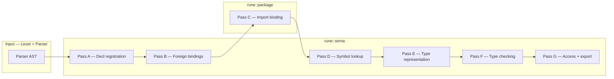

# Sema Internals

> **Scope:** `rune::sema` compiler library  
> **Location:** `Code/Rune/Sema/`

This document describes the internals of the Rune semantic analyzer (Sema). It is the core of the compiler front-end, responsible for giving meaning to the Abstract Syntax Tree (AST) produced by the parser. It enforces language rules, resolves names, checks type safety, and prepares the data required for module interface generation (`.runemodule`), bytecode emission, and transpilation.

## Overview

Unlike the parser, which only verifies grammatical structure, `rune::sema` maintains deep state about the program. It validates that variables are declared before use, functions are called with the correct arguments, and type conversions are safe.

The semantic pipeline is orchestrated through public entry points in `Sema.hpp`:
- `prepareModule(ASTContext&, parser::Program const&)`: Registers declarations and foreign bindings.
- `typeCheckProgram(ASTContext&, parser::Program const&)`: Resolves symbols, represents types, and type-checks the bodies.
- `typeCheckModule(...)`: A convenience method that prepares and type-checks a module without import binding.

## The `ASTContext` Hub

The long-lived state of semantic analysis is centralized in the **`ASTContext`** (`Sema/ASTContext.hpp`), heavily inspired by Swift's architecture. It owns the semantic data and arenas, ensuring memory locality and fast lookups throughout the pipeline.

Key components of `ASTContext` include:
- **`DeclRegistry` / `DeclContext`**: The hierarchical tree of scopes and bound declarations.
- **`ModuleDecl`**: Tracks module-level metadata like name, kind, and search paths.
- **`IdentifierTable`**: Interns strings into stable `IdentifierID` values.
- **`TypeArena`**: Interns and manages the memory for semantic types.
- **`DiagnosticEngine`**: Handles semantic error reporting.
- **`ForeignBindingTable`**: Tracks `@intrinsic` and `@symbol` metadata.

## Semantic Passes

Sema operates in a swiftc-style multi-pass pipeline. This cleanly separates declaration extraction from expression type checking, which is essential for handling out-of-order declarations and cross-file references.

### Pass A — Declaration Registration
**Files:** `DeclRegistration.cpp`, `DeclContext.cpp`, `DeclContext.hpp`

Runs during `prepareModule`. This pass walks the syntactic AST and establishes the core `DeclContext` tree (module → source file → static scope / nominal type / function / block). 
It creates semantic **`BoundDecl`** records with stable `DeclID`s, flags, and parental lineage. It does not check bodies or resolve cross-module references; it simply registers *where* every name lives and reports duplicate definitions within the same scope.

### Pass B — Foreign Bindings
**Files:** `ForeignBinding.cpp`, `ForeignAttributes.cpp`, `ForeignBindingTable.cpp`, `Intrinsics.cpp`

Runs during `prepareModule`. It parses AST attributes (like `@intrinsic` and `@symbol`) and populates the `ForeignBinding` table on the `ASTContext`. It links each binding to a `DeclID` so the bytecode interpreter and FFI layer know exactly how to invoke native or runtime hooks without reparsing.

### Pass C — Module Import Binding
**Files:** `Modules/Package/ImportBinding.cpp`, `PackageLoader.cpp` (Lives in `rune::package`)

This step bridges `prepareModule` and `typeCheckProgram`. Guided by `import` and `use` directives, the package loader loads compiled `.runemodule` dependencies. It brings exported signatures and interfaces into the current dependency state so they are available for Pass D.

### Pass D — Symbol Tables and Lookup
**Files:** `SymbolTable.cpp`, `SymbolTable.hpp`

Runs continuously during type checking. It resolves names to their semantic entities.
- **Qualified Lookup**: Resolves paths like `Math.PI` via static scope member lookup or `Module.symbol` when using `use Module`.
- **Unqualified Lookup**: Scans up the lexical `DeclContext` chain. If `import Module` is used, it also searches exported top-level public symbols from the imported module.

### Pass E — Type Representation
**Files:** `TypeArena.cpp`, `TypeResolution.cpp`, `TypeSerialization.cpp`, `DeclSignature.cpp`

Transforms syntactic `TypeExpression` nodes (from the parser) into canonical, semantic types (`SemanticType`).
Examples include:
- `SemanticTypeKind::Named` (`Int`, `String`)
- `SemanticTypeKind::Generic` (`Array<Int>`)
- `SemanticTypeKind::Function` (`(Int) -> Bool`)
- `SemanticTypeKind::Reference` (`*T`, `&T`)

Types are heavily interned in the `TypeArena`, meaning structural equivalence can often be checked via pointer comparison.

### Pass F — Type Checking
**Files:** `TypeChecker.cpp`, `TypeChecker.hpp`

The core behavioral pass (executed during `typeCheckProgram`). It visits all statements and expressions inside blocks and functions.
- Infers and checks types for expressions (assignments, literals, binary operations).
- Resolves overloads and methods.
- Validates `if`/`while` condition types, `return` compatibility, and exhaustive `match` patterns.
- Enforces mutability rules (`var` vs `let`, mutating methods).

### Pass G — Access Control and Export
**Files:** `AccessControl.cpp`, `Package/PackageWriter.cpp`

Enforces the `public`, `internal`, and `private` modifiers at use sites during type-checking. Once Sema finishes, it also dictates which declarations get serialized into the resulting `.runemodule` (filtering out block-local or private declarations) alongside their generic arities and type tables.

## Error Handling and Diagnostics

If Sema encounters an error (e.g., calling a method that doesn't exist, or assigning a `String` to an `Int`), it reports it via the `DiagnosticEngine`. 

Rather than aborting analysis immediately, Sema typically produces an `<ErrorType>` or dummy type node. This prevents cascading, unhelpful "missing type" errors on subsequent lines, allowing the compiler to report as many legitimate issues as possible in a single compilation.

## Sema Products

Sema does not rewrite or transform the AST. Instead, it annotates the AST and populates robust side-tables (`DeclRegistry`, `TypeArena`, `ForeignBindingTable`). 

Once semantic analysis concludes without fatal errors, these "Sema products" are consumed by:
1. **Bytecode Emitter**: Uses type layouts, function signatures, and resolved calls to generate deterministic bytecode.
2. **Transpiler**: Emits equivalent C++ code.
3. **LSP**: Provides hover information, autocomplete, and jump-to-definition.
4. **Package Writer**: Outputs the `.runemodule` format.